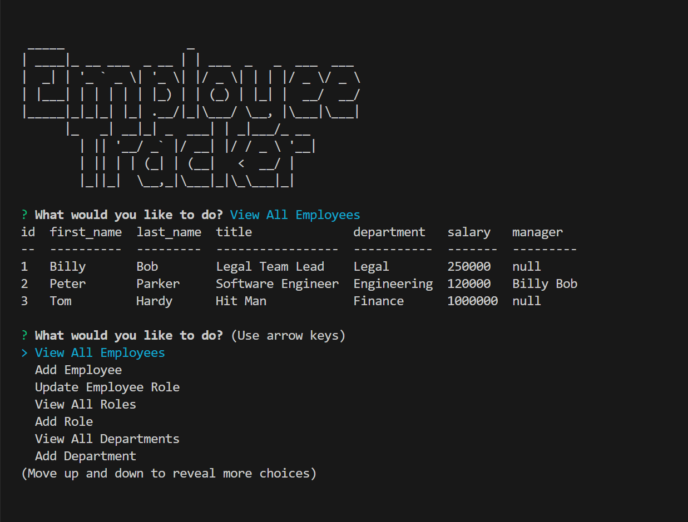

  # Employee Tracker
  [](./LICENSE)

  ## Description
  This is my 12-Challenge. In this challenge I had to create the code from the ground up. I had to implement inquirer and postgres SQL. Had to create a database that the user can engage with to track employee information and edit it. I found this project to be a little time-consuming figuring out how to get everything from the prompts and queries to work together. I had to rely on async and await functions to get the right timing down. Also, I worked on trying to modularize my code as well. In the end I think I turned out to be a decent application.

  ## Table of Contents 
  * [Installation](#installation)
  * [Usage](#usage)
  * [License](#license)
  * [Contributing](#contributing)
  * [Tests](#tests)
  * [Questions](#questions)

  ## Installation
  To install necessary dependencies, run the following command:
  ```
  npm i
  ```
  ## Usage
  To start the app, run the following command:
  
  ```
  node server.js
  ```
  You will be prompted with a series of questions, make a selection and follow the prompts.  
  The application will run in a loop until `Exit` is chosen from the main prompt.
  
  Image example of what to expect.\
  

  ## License
  This project is licensed under the **[MIT](./LICENSE)** license.

  ## Contributing
  N/A

  ## Tests
  To run tests, run the following command:
  ```    
  N/A
  ```
  ## Questions
  If you have any questions about the repo, open an issue or contact me directly at **rhinosstuff@gmail.com**.
  
  You can explore my other projects on GitHub **[rhinosstuff](https://github.com/rhinosstuff)**.
  
  